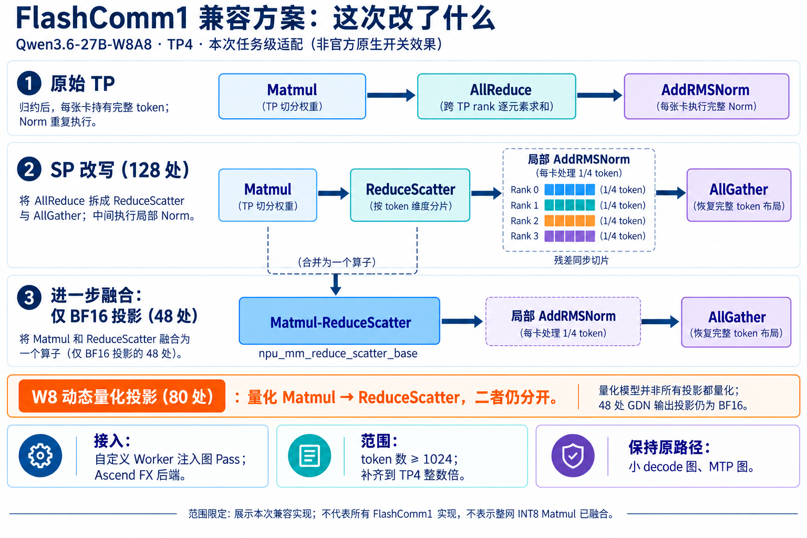

# FlashComm1、SP 与 MC2：概念、适配与 Qwen3.6-27B 历史实测

> 整理日期：2026-09-21。本文总结 2026-09-20 的 prefill MC2 实验和 2026-09-21 的 FlashComm1 兼容方案 r3 实验，使用已有数据，没有重新压测。**不包含后续 Model Runner V2 实验**，也不代表所有版本、模型或硬件的性能。

## 1. 先看结论

- **SP（Sequence Parallelism）是张量布局和计算组织方式**：沿 token 维度切分，使部分算子在各 rank 的局部 token 上执行。
- **FlashComm1 是具体的通信优化实现**，与 SP 有功能重叠。本文的兼容方案先做 SP 改写，再对符合条件的 BF16 投影融合 Matmul 与 ReduceScatter；不能把所有 FlashComm1 实现都定义成这两步。
- **本文的 MC2 路径是 Matmul–AllReduce 融合**：保留完整的归约输出布局，融合矩阵乘和通信。它与本次 FlashComm1 的 Matmul–ReduceScatter 融合有不同的输出布局。
- **W8A8 模型并不意味着所有投影都是 INT8 计算**。本次主模型中，48 处 GDN 输出投影仍采用 BF16，80 处其他投影采用 W8 动态量化。
- 两套候选都没有证明大幅、稳定的 TPOT 改善。MC2 的 TTFT 平均有所降低；FlashComm1 的 C4 记录呈现 TTFT 改善、TPOT 退化的取舍。

## 2. 一图看懂本次 FlashComm1 改动



*图中数量来自本次主模型编译图：128 处 SP 改写，其中 48 处进一步匹配 BF16 MMRS。它们是匹配位置数，不是性能占比，也不是每个 decode 步骤的融合 kernel 数。*

## 3. TP、SP、FlashComm1 和 MC2 的关系

### 3.1 原始行并行投影

以行并行投影为例，TP rank 持有权重的一部分；每张卡的 Matmul 得到完整 token 集合的部分和，随后跨 TP rank 求和：

```text
每个 rank 的 Matmul 部分结果
           ↓
AllReduce：跨 TP rank 逐元素求和
           ↓
每个 rank 都持有完整 token 的投影结果
           ↓
AddRMSNorm
```

这里 **AllReduce 不沿 token 维度做求和**。它归约的是不同 rank 对相同输出元素的贡献。

### 3.2 SP：在通信边界之间保留 token 分片

本次 SP 改写如下：

```text
原始：Matmul → AllReduce → AddRMSNorm
SP：  Matmul → ReduceScatter → 局部 AddRMSNorm → AllGather
```

ReduceScatter 一边完成跨 rank 归约，一边将结果沿 token 维度切分。TP4 下，每个 rank 只对补齐后约四分之一的 token 执行 Norm；之后 AllGather 恢复完整 token 布局。参与相加的 residual 也必须保持对应布局。

AllReduce 可以通过 ReduceScatter + AllGather 实现。因此，**不能仅凭算子拆分就断言通信字节减少或整体延迟下降**；这里明确减少的是中间 Norm 的重复计算，并为 Matmul 与 ReduceScatter 的融合提供匹配机会。本次改写也不意味着 attention、整个 MLP 或所有算子都只处理四分之一 token。

### 3.3 FlashComm1：本次增加 BF16 MMRS

```text
BF16 路径：
Matmul → ReduceScatter → 局部 AddRMSNorm → AllGather
             ↓ 融合前两项
Matmul-ReduceScatter → 局部 AddRMSNorm → AllGather

W8 动态量化路径：
量化 Matmul → ReduceScatter → 局部 AddRMSNorm → AllGather
（本次没有将量化 Matmul 与 ReduceScatter 合并）
```

MMRS 是本文对 Matmul–ReduceScatter 的简称，实际调用 `npu_mm_reduce_scatter_base`。**BF16 指这部分 GEMM 的输入和权重计算路径，不能仅凭量化 GEMM 输出为 BF16 就称其为 BF16 GEMM。**

### 3.4 MC2：本次融合的是 Matmul 与 AllReduce

```text
原始：Matmul → AllReduce → AddRMSNorm
MC2： Matmul-AllReduce → AddRMSNorm
```

本次 MC2 扩展调用 `npu_mm_all_reduce_base`，支持所选的 W8 动态量化投影和 BF16 投影。与 MMRS 不同，其结果仍是每个 rank 持有完整 token 的归约输出，不要求将后续 Norm 改成序列分片布局。

| 对比项 | SP-only | 本次 FlashComm1 兼容方案 | 本次 prefill MC2 |
|---|---|---|---|
| 主要变化 | RS → 局部 Norm → AG | SP + 部分 Matmul–RS 融合 | Matmul–AllReduce 融合 |
| 融合算子输出 | 无新增 Matmul 融合 | token 分片结果 | 完整 token 结果 |
| BF16 投影 | Matmul 与 RS 分开 | 满足匹配时融合 | 满足 prefill/形状条件时融合 |
| W8 动态量化投影 | 量化 Matmul 与 RS 分开 | 本次仍分开 | 满足条件时融合 |
| 本次小 decode 图 | 原路径 | 原路径 | 普通 AIV 路径 |

两者都调用已有底层融合算子；调用融合 API 本身不能证明实际重叠比例或节省多少毫秒。本文不推断底层黑盒内部调度，也不把两种输出布局不同的融合笼统视为相同方案。

## 4. 为什么这次不能只打开 FlashComm1 开关

本次固定版本：

| 组件 | Git SHA |
|---|---|
| vllm-ascend | `e139b7d573d3769fd1407d5027d7d4831f5469f0` |
| vLLM | `84030bbe3d74d99bad477a3d2e37a973ccd8865c` |

在这个 Ascend 版本中，配置入口仍接受：

```bash
--additional-config '{"enable_flashcomm1": true}'
# 旧环境变量也仍有兼容读取：VLLM_ASCEND_ENABLE_FLASHCOMM1=1
```

但 `AscendConfig` 会检查 `parallel_config.use_sequence_parallel_moe`；不满足条件时发出不支持 SP MoE 的警告。对应 vLLM 属性要求合适的 all-to-all backend、`enable_expert_parallel`、TP>1 和 DP>1。本次是稠密 Qwen、TP4、DP1，不满足这条配置路径。

当前官方 SP 文档也说明：原 FlashComm 功能自 v0.27.1 起弃用，暂时保留旧选项控制 SP MoE。这是版本演变，不是“FlashComm1 从来不支持稠密模型”。旧版文档与实现不能直接套用到本次固定版本。

因此，**此次测量的是任务级兼容方案，不是只打开官方开关的性能**。依据见文末的固定版本源码与官方说明。

## 5. FlashComm1 兼容方案具体做了什么

执行链：启动脚本加载自定义 Worker → 注册自定义算子和图 Pass → 编译时匹配重写 → 运行时执行现有 NPU 算子。

| 适配 | 实现位置（最终 r3 快照） | 作用与边界 |
|---|---|---|
| 编译接入 | `flashcomm1_worker.py:156`，`configure()` | 运行时包装 `GraphFusionPassManager.configure`，插入 `FlashComm1Pass` |
| SP 图改写 | `:108`，`FlashComm1Pass.register()` | AR+AddRMSNorm 改为 RS+局部 AddRMSNorm+AG |
| residual 布局 | `:61`，`maybe_chunk_residual()` | 已分片则复用；否则取本 rank 对应 token 分片 |
| BF16 MMRS | `:93`，`register_mmrs()`；`:30`，`matmul_reduce_scatter()` | 仅匹配 `unquantized_gemm → reduce_scatter`，调用已有 MMRS 算子 |
| 大批次范围 | `:128`，`is_applicable_for_range()` | 仅用于起点不少于 1024 token 的编译区间；不是逐请求 prefill 判定 |
| TP 对齐 | `:169`，`pad_large_batches()` | 大批次 token 数补齐到 TP 整数倍 |
| 排除 MTP | `:131`，`FlashComm1Pass.__call__()` | draft/MTP 图直接跳过，避免其独立 token 打包与主模型补齐逻辑冲突 |
| 编译后端 | `serve-flashcomm1-aiv.sh:23` | 自定义 Worker、Ascend FX，`enable_npugraph_ex=false`，区间端点 `[1023,6144]` |
| 验证记录 | `matmul_reduce_scatter()`、`__call__()` | 各 rank 图匹配计数；首次真实 M2048/M6144 输入的数值对照 |

四个 rank 的主模型大图均记录 128 处 SP 匹配，其中 48 处 MMRS；80 处 W8 投影保留独立 Matmul 与 RS。这里的 48 处是 GDN BF16 输出投影。MTP 与小 decode 图未做上述改写。

普通 collective 设置 `HCCL_OP_EXPANSION_MODE=AIV`。MMRS 使用 TP HCOM 域、`comm_turn=0` 和算子默认 `comm_mode`；**不能据普通 HCCL 环境变量宣称 MMRS 内部通信执行单元全部为 AIV**。

核心 Worker 共 193 行，启动脚本 41 行；运行所需两文件合计 234 行。另有压测编排 155 行、精度脚本 54 行，四文件共 443 行，包含空行和注释。原 vLLM/Ascend 源仓库未修改，但运行时确实注入了代码，所以不能称为“零代码适配”。

## 6. MC2 如何做到 prefill 融合、decode 使用 AIV

任务扩展 `prefill_mc2_worker.py` 的 `row_projection()` 同时检查真实 attention metadata 与 token 数，而不是只看张量大小：

```python
# 简化逻辑，非可直接运行的安装脚本
threshold = 1024 if is_mlp_down_proj else 4096
use_mc2 = enabled and has_prefill_metadata and num_tokens >= threshold

if use_mc2:
    # W8：保留原动态量化、weight scale、per-token scale，输出 BF16
    # BF16：使用原 BF16 权重
    output = npu_mm_all_reduce_base(..., comm_mode="ai_cpu")
else:
    output = original_matmul_then_aiv_allreduce(...)
```

- 选择 128 个主模型、2 个 MTP 行并行模块，但选择模块不意味着每次 forward 都融合。
- MLP down projection 门槛为 M≥1024；full-attention/GDN 输出投影为 M≥4096。
- MC2 使用与 TP ranks 一致的独立通信域；普通 TP 通信采用 AIV。`ai_cpu` 是此融合调用的通信模式，不是将 Matmul 放到 CPU 执行。
- 判定单位是 **执行批次**：含 prefill 的大混合批次整体走融合，其中 decode 行也随批次处理。纯 decode 和没有 prefill 标记的后续 MTP 步骤走普通路径。
- 同进程控制实验在上一组请求完成后切换开关，复用相同权重和 decode 图。OFF 也是同一个扩展 Worker 中的原 Matmul+AIV 路径，不等同于重新启动一个不带扩展的原生服务。

`enable_prefill_mc2` 这个现有配置名不能直接证明支持上述稠密行并行融合。本次是单独的任务扩展，不能把 MoE/容量控制中的 MC2 配置与该实现混为一谈。

## 7. 历史性能：两者没有显示大幅稳定的 TPOT 优势

### 7.1 共同测试条件

- Ascend 910B4，四卡；Qwen3.6-27B-W8A8，TP4/MTP5。
- `FULL_DECODE_ONLY`，capture sizes 为 `[6,12,18,24,30,36,42,48]`；batch6144、max_seqs8、max_model_len10240、显存比例 0.85、TQ1、无 prefix cache。
- 每条请求精确 8192 输入 +1024 输出；greedy、seed42、ignore_eos、skip-chat-template；固定同一性能数据集。
- C8 每个配置两轮，每轮 48 请求；C4/C1 各一轮，各 24/6 请求，均为并发数的 6 倍。每项实验连同自己的对照共 252 个正式请求。
- 表中为平均延迟；C8 按相同请求数合并，吞吐按总输出 token/总耗时合并。
- **ITL 是 SSE chunk 间隔**；MTP 每个 chunk 可能包含多个 token，因此不能把 ITL 当成单 token TPOT。

### 7.2 候选的绝对值

| 并发 | 方案 | TTFT ms ↓ | TPOT ms/token ↓ | ITL ms/chunk ↓ | 输出 token/s ↑ |
|---|---|---:|---:|---:|---:|
| C8 | MC2 + decode AIV | 2216.37 | 19.436 | 72.278 | 364.96 |
| C8 | FlashComm1 兼容方案 + AIV | 2201.09 | 19.511 | 72.913 | 363.63 |
| C4 | MC2 + decode AIV | 1727.12 | 13.546 | 50.598 | 261.26 |
| C4 | FlashComm1 兼容方案 + AIV | 1659.03 | 13.797 | 51.419 | 258.02 |
| C1 | MC2 + decode AIV | 1093.78 | 8.603 | 31.906 | 103.49 |
| C1 | FlashComm1 兼容方案 + AIV | 1117.90 | 8.483 | 31.984 | 104.53 |

按历史绝对值计算，FlashComm1 相对 MC2：C8 的 TPOT 高 0.39%；C4 的 TTFT 低 3.94%，但 TPOT 高 1.85%；C1 的 TPOT 低 1.39%，但 TTFT 高 2.20%。这些是不同时间记录的数值之比，**不是同场配对实验的因果收益**。

### 7.3 各自相对同期 AIV 对照的变化

延迟负值表示降低。两组对照的实现与测试时间不同，不合并成一条公共基线。

| 并发 | MC2 TTFT | FlashComm1 TTFT | MC2 TPOT | FlashComm1 TPOT | MC2 ITL | FlashComm1 ITL |
|---|---:|---:|---:|---:|---:|---:|
| C8 | -3.75% | +0.52% | +0.16% | -0.59% | -0.87% | -0.29% |
| C4 | -2.28% | -8.88% | -0.29% | +2.53% | -0.76% | +1.02% |
| C1 | -1.90% | +0.69% | +0.35% | -0.83% | -0.44% | +0.15% |

### 7.4 不能忽略的比较限制

1. MC2 是同进程 ON/OFF 对照；FlashComm1 候选使用 Ascend FX，而其原生对照保留默认 npugraph_ex。后者是整套配置净效果，不能全部归因于 MMRS。
2. MC2 的 C8 两轮 TTFT 变化方向相反；FlashComm1 的 C8 两轮 TPOT 变化方向也相反。小于 1% 的均值变化不构成稳定提升证据。
3. C4/C1 只有一轮，FlashComm1 的 C4 TTFT -8.88% 不能解释成稳定收益。
4. 共享主机负载、调度与 MTP acceptance 都可能影响测量。融合改变输出舍入后，接受长度和生成内容也可能改变，TPOT 变化不等于纯算子加速比例。
5. MC2 pilot、FlashComm1 失败 r1、SP-only r2 不混入上表；更晚的 MRV2 实验也不在本文范围内。

## 8. 精度：平均分持平不等于逐题无损

**MC2 扩展验证：** 共 2304 次请求，0 次接口/输入长度错误。主测试为 256 道填充到 8K 的数学题，两轮 OFF 正确数 246/248，ON 为 248/246，平均准确率均为 96.48%；按题聚类 bootstrap 的 ON−OFF 95% 区间为 [-0.98,+0.98] 个百分点。这是特定长上下文协议，不是标准 GSM8K 榜单成绩。

但原 32 题子集中有 1 题在两次配对中均出现 OFF 正确、ON 错误；因此不能宣称严格逐题无损。真实输入算子对照最大相对 L2 约 0.332%，输出也非逐位一致。

**FlashComm1 r3 功能验证：** 32 道 8K 数学题，原生对照 31/32，候选 30/32；候选有 1 条达到 1024 输出上限而截断，接口错误为 0。四个 rank 的首次 M2048/M6144 GDN 输入审计共 8 条，最大相对 L2 约 0.275%。这是局部算子检查与小样本功能测试，不是整网误差上界或完整精度验收。

两组精度测试的样本量、输出要求和并发协议不同，不能直接比较 96.48% 与 30/32 来判断谁更准确。1% 算子误差阈值也不能替代模型级精度标准。

## 9. 工程判断

- 对“只改配置即可使用”的判断，必须同时核对版本、模型类型、并行配置与实际 dispatch，不能只看开关名称。
- 对本次稠密模型，FlashComm1 兼容方案覆盖 SP 和 BF16 MMRS，尚没有新增 W8 动态量化 MMRS；不能据模型名推断所有 Matmul 的精度和融合方式。
- MC2 可以作为 TTFT 优化候选保留；本次 FlashComm1 在 C4 有首 token 改善，但 TPOT 同时退化。现有数据不足以支持以“大幅优化 TPOT”为由切换任一方案。
- 后续若评估其他后端或版本，应另立同条件对照，不能将新实验和本文历史值混合归因。本文整理没有启动服务或重新测试。

## 10. 源码与证据索引

### 可公开核对的上游源码与说明

- [官方 SP 说明](https://docs.vllm.ai/projects/ascend/en/main/user_guide/feature_guide/sequence_parallelism.html)：在线文档会更新；本文配置判断以以下固定版本代码为准。
- [固定 Ascend 版本的配置分支](https://github.com/wanghuanjun2113/vllm-ascend/blob/e139b7d573d3769fd1407d5027d7d4831f5469f0/vllm_ascend/ascend_config.py#L605)：`enable_flashcomm1`、兼容环境变量和 SP MoE 判断。
- [固定 vLLM 版本的并行条件](https://github.com/vllm-project/vllm/blob/84030bbe3d74d99bad477a3d2e37a973ccd8865c/vllm/config/parallel.py#L711)：`ParallelConfig.use_sequence_parallel_moe`。

### 本次实验归档（不随本文上传完整运行数据）

以下是实验任务归档中的相对路径，用于持有原归档者复核；不是本仓库中的链接。

| 归档路径 | 内容 |
|---|---|
| `reports/PREFILL_MC2_COMPARISON.md` | MC2 同进程正式性能对照，含 pilot 分离说明 |
| `reports/MC2_ACCURACY_EXTENDED.md` | 2304 次扩展精度结果与逐题回退 |
| `reports/FLASHCOMM1_AIV_COMPARISON.md` | FlashComm1 r3 结果、图证据、实现边界 |
| `reports/FLASHCOMM1_VS_MC2_HISTORY.md` | 历史结果交叉比较 |
| `data/prefill_mc2_20260920/comparison.json` | MC2 聚合数据，本文只取 `controlled_comparison` |
| `data/flashcomm1_aiv_20260921/comparison-r3.json` | FlashComm1 最终聚合数据 |
| `data/flashcomm1_aiv_20260921/code-r3/` | 本文 FlashComm1 代码行号和规模对应的冻结快照 |
| `data/flashcomm1_aiv_20260921/mc2-preserved/prefill_mc2_worker.py` | MC2 扩展保留副本，`row_projection()` 为路由入口 |

性能数据集 SHA256：`6708bb0228da0565f0da0f7e11bc0db43bfc1f582cbab55b82c69e10a2dd108c`。

聚合数据文件 SHA256：

- `data/prefill_mc2_20260920/comparison.json`：`33567f05ff0abf1da2219f267032cda1c881ebcada5773d9efaa085eef9879a7`
- `data/flashcomm1_aiv_20260921/comparison-r3.json`：`44c8eb3b2fbb2d0af783a6aca8f3584fb3bb2ba8343a4aa0a441ac4e3d5b92c2`
