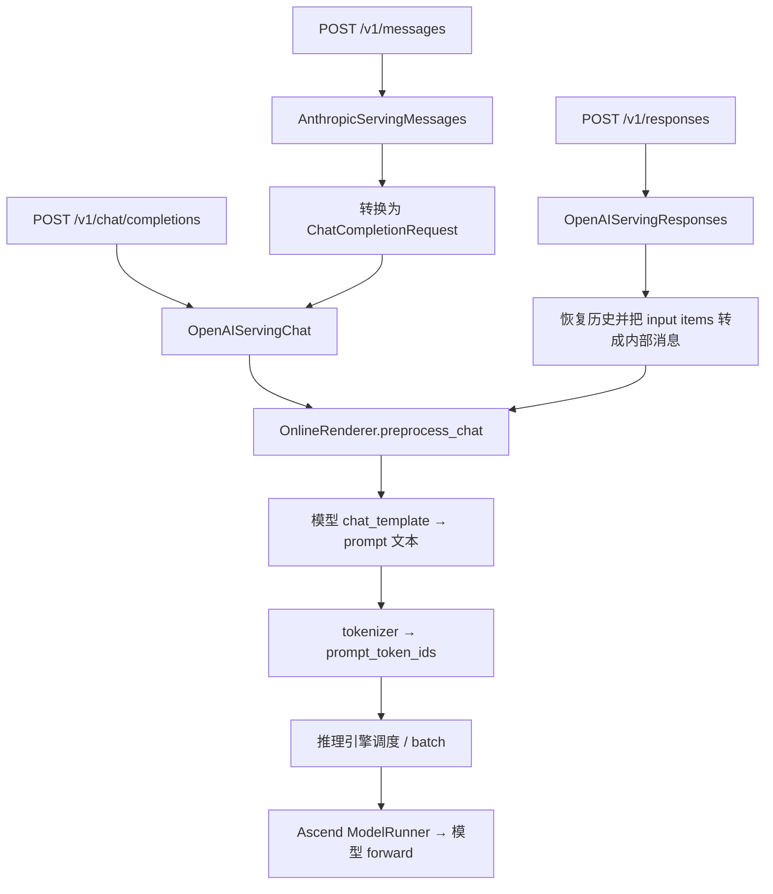

# vLLM / vLLM-Ascend 的三种对话接口：Chat Completions、Anthropic Messages 与 Responses

三种接口分别使用消息列表、消息内容块和条目序列来表达对话。它们的 JSON、工具调用表示和输出事件不同；对于 Qwen3.6 这类使用普通聊天模板的模型，vLLM 会把这些协议转换成内部消息，再执行模型模板、编码为 token IDs，最后由推理引擎执行。

本文先比较协议，再用同一份“系统指令＋多轮交互＋天气工具调用”展示三种完整请求，最后追踪它们在 vLLM / vLLM-Ascend 中的汇合点。

## 1. 范围与版本

核对日期：2026-09-22。

| 对象 | 核对版本 |
|---|---|
| vLLM | `eb42686a30cddf325ffeff7b3bd5e3a7298c2c00` |
| vLLM-Ascend | `e6a133f710c54e84cefcd29be46678c50008e8ea` |
| Qwen3.6-27B 官方聊天模板 | `6a9e13bd6fc8f0983b9b99948120bc37f49c13e9` |

本文结论以文末固定版本的源码链接为准，不推断所有旧版、量化镜像或私有部署均有相同能力。验证范围是源码检查、JSON 示例检查和官方 Jinja 模板的本地渲染；没有启动 NPU 服务，也没有执行真实天气工具或模型生成。

模型名 `Qwen/Qwen3.6-27B` 是示例服务名，实际请求必须与部署时的模型名或 `--served-model-name` 一致。文中的天气数据是虚构示例。

## 2. 整体架构：三种入口，汇入模型输入处理



这是本文 Qwen3.6 普通聊天模板路径的图。Responses 中另有 Harmony 专用分支，不能把上述流程推广到所有模型；见 [`render_responses()`][renderer]。

三个边界需要区分：

- **API 协议边界**：JSON 校验、字段转换、响应封装在 vLLM 服务端完成。Anthropic handler 继承 `OpenAIServingChat`；Responses 使用独立 handler，再复用 renderer。[源码：Anthropic 转换与调用][anthropic-serving]、[Responses handler][responses-serving]。
- **模型格式边界**：`HfRenderer.render_messages_async()` 执行聊天模板；`BaseRenderer.render_chat_async()` 随后进行 tokenization。模型格式由模板及其参数决定。[源码：HF renderer][hf]、[tokenization][base-renderer]。
- **设备执行边界**：vllm-ascend runner 接收组织好的 `input_ids`、位置及注意力相关元数据，调用模型。该路径不重新解析三种 HTTP JSON。[源码：Ascend runner][ascend-runner]。

## 3. 协议对照

| 维度 | OpenAI Chat Completions | Anthropic Messages | OpenAI Responses |
|---|---|---|---|
| HTTP 入口 | `/v1/chat/completions` | `/v1/messages` | `/v1/responses` |
| 输入主体 | `messages[]` | `messages[]`，内容可为 block 数组 | `input`：字符串或 item 数组 |
| 系统指令 | `role: "system"` 消息；developer 的支持需看模型模板 | 顶层 `system` | 顶层 `instructions`，也可提供输入消息 |
| 工具定义 | `tools[].function.{name,parameters}` | `tools[].{name,input_schema}` | `tools[].{type:"function",name,parameters}` |
| 历史工具调用 | assistant 消息里的 `tool_calls[]` | assistant 内容中的 `tool_use` block | 独立 `function_call` item |
| 调用参数 | `function.arguments`：JSON 字符串 | `input`：JSON 对象 | `arguments`：JSON 字符串 |
| 工具结果 | `role: "tool"` 消息 | user 内容中的 `tool_result` block | `function_call_output` item |
| 调用关联键 | 调用 `id` ↔ 结果 `tool_call_id` | `id` ↔ `tool_use_id` | 两边的 `call_id` |
| 输出主体 | `choices[].message` | `content[]` | `output[]` |
| 常用输出长度字段 | `max_completion_tokens`；vLLM 也接受 `max_tokens` | `max_tokens` | `max_output_tokens` |
| 本文的多轮方式 | 客户端携带历史 | 客户端携带历史 | 客户端携带历史；也可使用服务端保存的响应链 |

字段定义参见 [Chat 协议][chat-protocol]、[Anthropic 协议][anthropic-protocol]、[Responses 协议][responses-protocol]。OpenAI 对 Responses 的 item 设计及迁移说明见[官方文档][openai-migration]；Anthropic 顶层 system 和消息块语义见[官方 Messages 文档][anthropic-doc]。

### 3.1 Chat Completions：围绕消息组织

用户消息、assistant 回复和工具返回都位于 `messages`。工具调用附着在 assistant 消息上，工具结果则使用专门的 `tool` 角色。服务端入口是 [`create_chat_completion()`][chat-route]。

### 3.2 Anthropic Messages：围绕消息内的内容块组织

一个 assistant 消息的 `content` 可以同时包含文本和工具调用块。工具结果由下一条 user 消息中的 `tool_result` 表示。当前 vLLM 会把 `tool_use` 转成内部 assistant `tool_calls`，把 user 的 `tool_result` 转成内部 tool 消息。[源码：`_convert_block()`、`_convert_user_tool_result()`][anthropic-serving]。

官方协议把 system 放在顶层。当前 vLLM 的 `AnthropicMessage` 还接受 `role="system"`，这是实现的兼容扩展；需要跨服务可移植的请求应遵循官方顶层写法。[源码][anthropic-protocol]。

### 3.3 Responses：围绕有类型的条目组织

`input` / `output` 中可以有消息、工具调用、工具结果和 reasoning 等条目。同一段 assistant 行为可能跨越多个 item；当前 vLLM 的 `construct_chat_messages_with_tool_call()` 会按类型组合这些条目。[源码][responses-utils]。

它还有响应 ID、保存/获取响应和继续响应链等机制。仅把 `messages` 改名为 `input`，不足以正确迁移工具调用与流式客户端。

## 4. 同一场景的三种完整请求

共同场景：用户先说准备去杭州，再询问天气；模型此前调用了 `get_weather`，应用已经执行工具，现在把结果送回模型，请它给出最终建议。

这些是“工具返回之后”的请求快照。实际交互中，应用先收到模型的工具调用，执行自己的函数，再构造下一次请求；下面的调用记录和天气结果是人为构造的教学数据。

三种请求都使用当前 vLLM 扩展字段 `chat_template_kwargs.enable_thinking=false`，以控制 Qwen 模板的生成前缀。它不是三家原生协议均保证支持的通用字段。[Anthropic 字段与转发][anthropic-protocol]、[Responses 字段][responses-protocol]。

### 4.1 Chat Completions

发送到 `POST /v1/chat/completions`：

```json
{
  "model": "Qwen/Qwen3.6-27B",
  "messages": [
    {
      "role": "system",
      "content": "你是中文天气助手。天气信息必须以工具结果为准，回答简洁。"
    },
    {
      "role": "user",
      "content": "我准备去杭州。"
    },
    {
      "role": "assistant",
      "content": "好的，你想了解杭州的什么信息？"
    },
    {
      "role": "user",
      "content": "杭州今天的天气怎么样？适合散步吗？"
    },
    {
      "role": "assistant",
      "content": "",
      "tool_calls": [
        {
          "id": "call_001",
          "type": "function",
          "function": {
            "name": "get_weather",
            "arguments": "{\"city\":\"杭州\"}"
          }
        }
      ]
    },
    {
      "role": "tool",
      "tool_call_id": "call_001",
      "content": "{\"city\":\"杭州\",\"weather\":\"晴\",\"temperature_c\":25}"
    }
  ],
  "tools": [
    {
      "type": "function",
      "function": {
        "name": "get_weather",
        "description": "查询指定城市今天的天气。",
        "parameters": {
          "type": "object",
          "properties": {
            "city": {
              "type": "string",
              "description": "城市名称"
            }
          },
          "required": [
            "city"
          ]
        }
      }
    }
  ],
  "tool_choice": "auto",
  "chat_template_kwargs": {
    "enable_thinking": false
  },
  "max_completion_tokens": 128,
  "stream": false
}
```

`arguments` 是 JSON 字符串，因此外层 JSON 中有转义。vLLM 在执行模板前通过 `_postprocess_messages()` 把它解析成字典；工具结果 `content` 在本例中仍然是普通字符串。[源码][chat-utils]。

### 4.2 Anthropic Messages

发送到 `POST /v1/messages`：

```json
{
  "model": "Qwen/Qwen3.6-27B",
  "max_tokens": 128,
  "system": "你是中文天气助手。天气信息必须以工具结果为准，回答简洁。",
  "messages": [
    {
      "role": "user",
      "content": "我准备去杭州。"
    },
    {
      "role": "assistant",
      "content": "好的，你想了解杭州的什么信息？"
    },
    {
      "role": "user",
      "content": "杭州今天的天气怎么样？适合散步吗？"
    },
    {
      "role": "assistant",
      "content": [
        {
          "type": "tool_use",
          "id": "call_001",
          "name": "get_weather",
          "input": {
            "city": "杭州"
          }
        }
      ]
    },
    {
      "role": "user",
      "content": [
        {
          "type": "tool_result",
          "tool_use_id": "call_001",
          "content": "{\"city\":\"杭州\",\"weather\":\"晴\",\"temperature_c\":25}"
        }
      ]
    }
  ],
  "tools": [
    {
      "name": "get_weather",
      "description": "查询指定城市今天的天气。",
      "input_schema": {
        "type": "object",
        "properties": {
          "city": {
            "type": "string",
            "description": "城市名称"
          }
        },
        "required": [
          "city"
        ]
      }
    }
  ],
  "tool_choice": {
    "type": "auto"
  },
  "stream": false,
  "chat_template_kwargs": {
    "enable_thinking": false
  }
}
```

这里 `tool_use.input` 已经是对象，不需要字符串转义。vLLM 会先把它序列化到内部 `function.arguments`，后续聊天预处理再将参数解析为模板所需的字典。[源码：`_convert_tool_use_block()`][anthropic-serving]。

### 4.3 Responses

发送到 `POST /v1/responses`：

```json
{
  "model": "Qwen/Qwen3.6-27B",
  "instructions": "你是中文天气助手。天气信息必须以工具结果为准，回答简洁。",
  "input": [
    {
      "role": "user",
      "content": "我准备去杭州。"
    },
    {
      "role": "assistant",
      "content": "好的，你想了解杭州的什么信息？"
    },
    {
      "role": "user",
      "content": "杭州今天的天气怎么样？适合散步吗？"
    },
    {
      "type": "function_call",
      "call_id": "call_001",
      "name": "get_weather",
      "arguments": "{\"city\":\"杭州\"}"
    },
    {
      "type": "function_call_output",
      "call_id": "call_001",
      "output": "{\"city\":\"杭州\",\"weather\":\"晴\",\"temperature_c\":25}"
    }
  ],
  "tools": [
    {
      "type": "function",
      "name": "get_weather",
      "description": "查询指定城市今天的天气。",
      "parameters": {
        "type": "object",
        "properties": {
          "city": {
            "type": "string",
            "description": "城市名称"
          }
        },
        "required": [
          "city"
        ]
      }
    }
  ],
  "tool_choice": "auto",
  "max_output_tokens": 128,
  "store": false,
  "stream": false,
  "chat_template_kwargs": {
    "enable_thinking": false
  }
}
```

`function_call` 与 `function_call_output` 是两个独立 item；`call_id` 用于关联二者。`store:false` 表示本例由客户端显式携带历史，不依赖服务端响应存储。

## 5. 三种请求怎样变成 Qwen3.6 输入

### 5.1 内部消息的归一化

对上面的纯文本示例，三条路径表达的目标内部结构为：

```text
system:    你是中文天气助手……
user:      我准备去杭州。
assistant: 好的，你想了解杭州的什么信息？
user:      杭州今天的天气怎么样？适合散步吗？
assistant: tool_calls=[get_weather(city="杭州")]
tool:      {"city":"杭州","weather":"晴","temperature_c":25}
```

- Chat：已有消息结构，进入消息规范化与模板渲染。
- Anthropic：`to_chat_completion_request()` 生成 `ChatCompletionRequest`，然后调用 `create_chat_completion()`。[源码][anthropic-serving]。
- Responses：`construct_input_messages()` 把 `instructions` 放入 system 消息；`_construct_message_from_response_item()` 转换工具 item；`render_responses()` 再调用 `preprocess_chat()`。[源码：条目转换][responses-utils]、[渲染入口][renderer]。

这是源码层面的映射，不是三条真实 HTTP 请求的逐字节一致性测试。要验证 prompt 完全相同，还需对齐工具 schema 的默认字段、模板参数、历史 reasoning、内容格式以及最终消息续写选项。

### 5.2 Qwen3.6 模板的实际文本结构

以下依据固定版本的[官方模板][qwen-template]本地渲染。为了突出消息边界，仅省略模板固定的英文工具说明及完整 schema；方括号说明不属于真实 prompt。

```text
<|im_start|>system
# Tools

[模板固定的英文工具介绍]

<tools>
[get_weather 的完整工具定义 JSON]
</tools>

[模板固定的英文工具调用格式与约束]

你是中文天气助手。天气信息必须以工具结果为准，回答简洁。<|im_end|>
<|im_start|>user
我准备去杭州。<|im_end|>
<|im_start|>assistant
好的，你想了解杭州的什么信息？<|im_end|>
<|im_start|>user
杭州今天的天气怎么样？适合散步吗？<|im_end|>
<|im_start|>assistant
<think>

</think>

<tool_call>
<function=get_weather>
<parameter=city>
杭州
</parameter>
</function>
</tool_call><|im_end|>
<|im_start|>user
<tool_response>
{"city":"杭州","weather":"晴","temperature_c":25}
</tool_response><|im_end|>
<|im_start|>assistant
<think>

</think>

```

这个模板有几个直接影响输入的行为：

1. 有工具时，工具定义及使用说明放在 system 段前面，用户的 system 内容接在后面。
2. 工具调用转成 `<tool_call>`、`<function=...>` 和 `<parameter=...>`；不是原始 HTTP JSON。
3. tool 消息转成 user 段中的 `<tool_response>`；连续 tool 消息可合并在同一个 user 段。
4. 模板未输出本例的 `call_001`。关联 ID 在协议层有用，并不保证作为文字进入模型。
5. 最后添加未结束的 assistant 段，模型从这里继续生成。`enable_thinking=false` 添加空 thinking 块；启用时生成前缀以打开的 `<think>` 结束。
6. 最后一条真实 user 查询之后的历史 assistant 消息会带 reasoning 区域；本例没有历史 reasoning，所以工具调用前的 thinking 块为空。

以上行为属于该版本 Qwen3.6 模板，不是三种 HTTP 协议共同规定的行为。切换模型或覆盖 `--chat-template`，文本布局可能改变。

### 5.3 文本与模型张量的边界

`BaseRenderer.render_chat_async()` 先获得渲染结果，再调用 `tokenize_prompts_async()`，生成引擎输入。调度后，Ascend runner 调用 `_model_forward(..., input_ids, positions, ...)`。[源码：编码][base-renderer]、[模型调用][ascend-runner]。

因此模型 forward 不接收 `messages`、`input` 或 `tool_use` 这些 HTTP 字段；它接收 token IDs 等张量。上述可读标记是文本层表示，其编码由 tokenizer 决定，不能假定每个 XML 标签都对应一个独立特殊 token。

## 6. 输出和流式事件也不同

下面是回答“杭州今天晴，25℃，适合散步。”时的字段结构示意，省略 ID、usage、时间戳等，并非完整服务响应。

| 接口 | 普通回答所在字段 | 工具调用所在位置 | 结束状态的典型表示 |
|---|---|---|---|
| Chat Completions | `choices[0].message.content` | `choices[0].message.tool_calls` | `finish_reason="stop" / "tool_calls" / "length"` |
| Anthropic Messages | `content` 中的 text block | `content` 中的 tool_use block | `stop_reason="end_turn" / "tool_use" / "max_tokens"` |
| Responses | `output` 中 message item 的 output_text 内容块 | `output` 中的 function_call item | response 的 `status` 与 incomplete 信息；工具调用以 item 表达 |

Anthropic 的结束原因映射见 `AnthropicServingMessages.stop_reason_map`；Responses 的 item 构造见 `_make_response_output_items()`。[Anthropic 输出实现][anthropic-serving]、[Responses 输出实现][responses-serving]。

启用 `stream:true` 时也不能共用一套未经适配的事件解析器：

- Chat 主要读取 `choices[].delta`，其中可包含文本或工具调用参数的增量。
- Anthropic 使用 `message_start`、`content_block_start`、`content_block_delta`、`content_block_stop`、`message_delta`、`message_stop` 等事件。
- Responses 使用 `response.*` 类型事件，包括文本 delta、输出 item 生命周期，以及完成或未完成等状态。

源码入口分别为 Chat 的流式生成逻辑、`message_stream_converter()` 和 `responses_stream_generator()`。[Chat serving][chat-serving]、[Anthropic serving][anthropic-serving]、[Responses serving][responses-serving]。

## 7. 多轮历史、响应存储与 KV cache

### 7.1 显式携带历史

本例三个请求均携带完整相关历史。服务端据此重建模型上下文。普通自定义函数由应用执行，调用记录与工具返回值也由应用带回；兼容接口的存在不意味着服务器会自动执行任意业务函数。

### 7.2 Responses 的 previous_response_id

Responses 也可引用已保存的响应，在新请求中仅提供新增输入。当前 vLLM 中有两个前提：

- 环境变量 `VLLM_ENABLE_RESPONSES_API_STORE=1` 开启存储；默认值为 0。
- 前一次响应实际被保存，且下一次请求能访问保存它的服务进程。

当前实现使用进程内的 `response_store` / `msg_store` 字典。未开启存储时，请求的 `store:true` 会被改为 false；查询不到 `previous_response_id` 会返回 not-found。它不是跨进程的持久会话数据库。[源码：存储初始化与查询][responses-serving]、[环境变量默认值][envs]。

恢复历史时，当前请求的 `instructions` 会重新加入，而旧的 instructions 不自动继承；需要持续生效的指令应在后续请求中再次提供。[源码：`construct_input_messages()`][responses-utils]。

### 7.3 与 KV cache 的关系

`previous_response_id` 用于在服务层找回历史消息和输出，再构造输入；上述源码没有把这个 ID 当作设备 KV block 标识。响应历史存储和推理引擎的 KV cache 是不同机制，不能因为使用响应链就推断“跳过 prefill”或“必然命中 prefix cache”。

## 8. 当前兼容范围与接入检查

当前源码已经注册三个生成接口。Anthropic 还提供 `/v1/messages/count_tokens`；Responses 提供获取和取消响应的路由。[生成服务注册][registration]、[Anthropic 路由][anthropic-route]、[Responses 路由][responses-route]。

但“有路由”“字段能解析”“该功能端到端可用”是三种不同证据。两个具体例子：

- Responses 的转换代码遇到带 `encrypted_content` 的 reasoning item 会报 `Encrypted content is not supported.`。[源码][responses-utils]。
- Anthropic 的 `redacted_thinking` block 可以被接收，但转换代码跳过其中不透明的内容。[源码][anthropic-serving]。

因此不能把 OpenAI/Anthropic 云服务的内置工具、文件服务、加密推理状态等能力，直接等同于本地 vLLM 的实现。

接入现有 vllm-ascend 服务时，建议按下列顺序做最小验证：

1. 核对实际 vLLM 版本、模型服务名、加载的聊天模板，以及 tool/reasoning parser 配置。本文版本的 `tool_choice="auto"` 路径会检查自动工具调用配置。[源码：`OnlineRenderer.render_chat()`][renderer]。
2. 发送普通文本请求，确认目标接口存在并能生成；再发送本文对应的完整工具历史请求。
3. 最后验证真实工具闭环和流式事件重组。请求体能通过 JSON 解析，不代表模型会正确选择工具，也不代表流式客户端能正确拼接参数。

例如把 4.1 的 JSON 保存为 `chat.json`，在未开启鉴权的本地服务上执行：

```bash
curl http://localhost:8000/v1/chat/completions   -H 'Content-Type: application/json'   --data-binary @chat.json
```

另外两个示例分别保存为 `messages.json`、`responses.json`，替换请求路径与文件名即可。开启鉴权时按实际服务配置添加凭据。这里是接入说明，本文未执行这些在线请求。

## 9. 如何选择

| 已有需求 | 优先考虑 | 原因 |
|---|---|---|
| 客户端已经围绕 `messages` 与 `tool_calls` 开发 | Chat Completions | 对接现有消息结构，迁移工作少 |
| 客户端使用 Anthropic SDK 或 block 风格工具交互 | Anthropic Messages | 保留客户端协议，由 vLLM 转换内部结构 |
| 应用需要 item 序列、独立工具条目和响应链 | Responses | 数据结构直接表达这些概念；需核对本地存储和功能支持 |

这只是基于协议结构的选择依据，不构成性能优劣结论。相同模型上的性能比较，还要匹配最终 token 输入、采样、并发、缓存和执行配置。

## 10. 源码与官方文档

下列代码链接固定到本文核对的提交。后续阅读其他版本时，应先确认函数位置和默认配置是否变化。

- [Chat API 路由][chat-route]、[Chat 请求/响应模型][chat-protocol]、[Chat serving][chat-serving]。
- [Anthropic API 路由][anthropic-route]、[协议模型][anthropic-protocol]、[协议转换与响应封装][anthropic-serving]。
- [Responses API 路由][responses-route]、[协议模型][responses-protocol]、[条目转换][responses-utils]、[生成与存储][responses-serving]。
- [服务注册][registration]、[OnlineRenderer][renderer]、[HF 模板渲染][hf]、[模板后编码][base-renderer]、[工具参数规范化][chat-utils]。
- [vLLM-Ascend 模型执行][ascend-runner]、[Qwen3.6-27B 官方模板][qwen-template]。
- [OpenAI Responses 迁移指南][openai-migration]、[Anthropic Messages API 文档][anthropic-doc]。

[chat-route]: https://github.com/wanghuanjun2113/vllm/blob/eb42686a30cddf325ffeff7b3bd5e3a7298c2c00/vllm/entrypoints/openai/chat_completion/api_router.py#L42
[chat-protocol]: https://github.com/wanghuanjun2113/vllm/blob/eb42686a30cddf325ffeff7b3bd5e3a7298c2c00/vllm/entrypoints/openai/chat_completion/protocol.py
[chat-serving]: https://github.com/wanghuanjun2113/vllm/blob/eb42686a30cddf325ffeff7b3bd5e3a7298c2c00/vllm/entrypoints/openai/chat_completion/serving.py#L219
[anthropic-route]: https://github.com/wanghuanjun2113/vllm/blob/eb42686a30cddf325ffeff7b3bd5e3a7298c2c00/vllm/entrypoints/anthropic/api_router.py#L52
[anthropic-protocol]: https://github.com/wanghuanjun2113/vllm/blob/eb42686a30cddf325ffeff7b3bd5e3a7298c2c00/vllm/entrypoints/anthropic/protocol.py#L36
[anthropic-serving]: https://github.com/wanghuanjun2113/vllm/blob/eb42686a30cddf325ffeff7b3bd5e3a7298c2c00/vllm/entrypoints/anthropic/serving.py#L98
[responses-route]: https://github.com/wanghuanjun2113/vllm/blob/eb42686a30cddf325ffeff7b3bd5e3a7298c2c00/vllm/entrypoints/openai/responses/api_router.py#L49
[responses-protocol]: https://github.com/wanghuanjun2113/vllm/blob/eb42686a30cddf325ffeff7b3bd5e3a7298c2c00/vllm/entrypoints/openai/responses/protocol.py#L137
[responses-utils]: https://github.com/wanghuanjun2113/vllm/blob/eb42686a30cddf325ffeff7b3bd5e3a7298c2c00/vllm/entrypoints/openai/responses/utils.py#L162
[responses-serving]: https://github.com/wanghuanjun2113/vllm/blob/eb42686a30cddf325ffeff7b3bd5e3a7298c2c00/vllm/entrypoints/openai/responses/serving.py#L148
[registration]: https://github.com/wanghuanjun2113/vllm/blob/eb42686a30cddf325ffeff7b3bd5e3a7298c2c00/vllm/entrypoints/generate/api_router.py
[renderer]: https://github.com/wanghuanjun2113/vllm/blob/eb42686a30cddf325ffeff7b3bd5e3a7298c2c00/vllm/renderers/online_renderer.py#L170
[hf]: https://github.com/wanghuanjun2113/vllm/blob/eb42686a30cddf325ffeff7b3bd5e3a7298c2c00/vllm/renderers/hf.py#L1140
[base-renderer]: https://github.com/wanghuanjun2113/vllm/blob/eb42686a30cddf325ffeff7b3bd5e3a7298c2c00/vllm/renderers/base.py#L1195
[chat-utils]: https://github.com/wanghuanjun2113/vllm/blob/eb42686a30cddf325ffeff7b3bd5e3a7298c2c00/vllm/entrypoints/chat_utils.py#L2081
[envs]: https://github.com/wanghuanjun2113/vllm/blob/eb42686a30cddf325ffeff7b3bd5e3a7298c2c00/vllm/envs.py#L1852
[ascend-runner]: https://github.com/wanghuanjun2113/vllm-ascend/blob/e6a133f710c54e84cefcd29be46678c50008e8ea/vllm_ascend/worker/model_runner_v1.py#L2379
[qwen-template]: https://huggingface.co/Qwen/Qwen3.6-27B/blob/6a9e13bd6fc8f0983b9b99948120bc37f49c13e9/chat_template.jinja
[openai-migration]: https://developers.openai.com/api/docs/guides/migrate-to-responses
[anthropic-doc]: https://platform.claude.com/docs/en/api/messages/create
